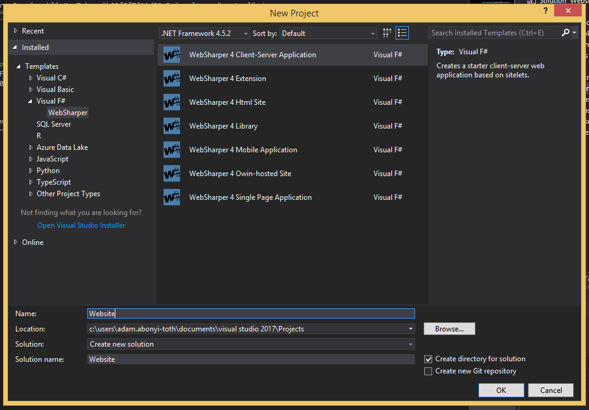
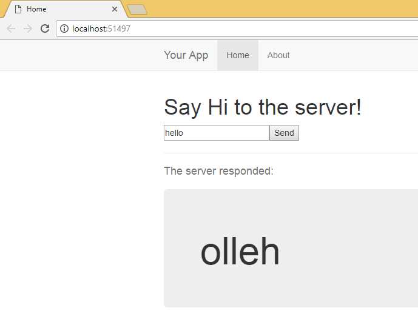
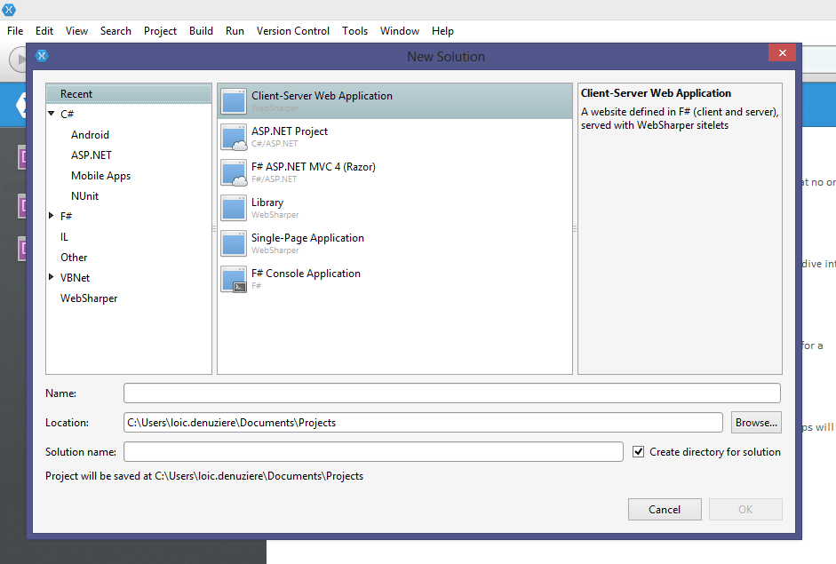

# Getting Started with WebSharper for F# #

This article will walk you through getting a WebSharper
example up and running.

## Creating a project

### With Visual Studio

After completing [the installation](Install.md), open Visual Studio and create a new project ("Website"):

    File > New Project > Templates > Visual F# >
    WebSharper > WebSharper 4 Client-Server Application
	

This project defines a simple website, with both server and
client-side components.  To try it out, simply "Run" (F5) - you should
now see the code in action:

### With MonoDevelop / Xamarin Studio

After completing [the installation](Install-XS.md), open MonoDevelop / Xamarin Studio and create a new project ("Website"):

    File > New > Solution... >
    WebSharper > Client-Server Web Application

The rest of the process is the same as with Visual Studio.

## The project files

Let us look at what the code does.

### Client Module

This is the most interesting module (see `Client.fs`). Having it
marked `[<JavaScript>]` makes WebSharper cross-compile all code in
this module to JavaScript and run it in the browser.

The `Main` method is what is invoked as the client-side entry point. It
generates some DOM elements dynamically and returns them so that we can
include them on both client and server side.

The most interesting part is the remote server query. `rvInput` is a
`Var`, a reactive variable. We initiate it with an empty string. As you
can see a couple of lines later, we will use this `Var` to hold the
value of a text input.

The most important part of **UI.Next** is the `View` type. A `View` is
a time-varying value that can be mapped and inserted into the DOM, for
example. Next, we create a `Submitter` of `rvInput.View`. As `rvInput.View`
would change with any keystroke in the input field, we will use this
submitter to only act when the `Send` button is clicked. The submitter
has it's own `View`, too, which will reflect `rvInput.View`'s value every
time `submit.Trigger` is called.

Now comes the exciting part: we create our final `View`, `vReversed`, which
will have the data that the server sends back. We create it by mapping an
`async` function over our submitter's `View`. If no value has been submitted
yet, the function simply returns an empty string. On the other hand, if the
submitter has a value, we call a server-side function just as simply as
returning the empty string was! And with that, we get our `View` which always
contains the last response from the server.

The rest of the code takes care of binding these reactive elements into the
DOM.

### Remoting Module

This module (`Remoting.fs`) defines the `DoSomething` function that is
executed on the server but is also available on the client. Execution
happens by serializing arguments and return value and passing them
over HTTP. Not all types are supported, WebSharper will warn you
about potential problems at compile time.

### Site Module

The main module (`Main.fs`) defines the page structure of your
website, the main HTML template to use, takes care of managing
the website's header. For us, the only important part is
`client <@ Client.Main() @>`, as this code snippet enables us to insert
client-side code into the answer of the server.

As you are starting out, you may just consider this boilerplate and
focus on programming the client-side logic. For diving deeper,
reference documentation is available by topic in the manual.

### Main Template

The `Main.html` file provides the overall template that is by default
applied to every page of your website.  You can edit the HTML to
adjust the overall layout and look-and-feel. Another one of the most
powerful features of **UI.Next** is that with appropriate template settings,
you can modify the `Main.html` and see the result with just a refresh in the
browser, _without having to compile the project again_! This enables fast iteration
on the design and opens the door to rapid web development.
