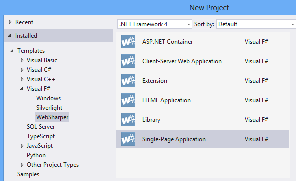

# Installing WebSharper for Visual Studio

Developing with WebSharper in Visual Studio currently requires:

* [Visual Studio 2015 or later][vs] with Web Developer Tools installed.
Also Visual F# Tools is needed to use WebSharper for F#.

When your environment is ready, download and install the
WebSharper `.vsix` file for one or both languages from the [WebSharper download page][downloads].
These will install the WebSharper project templates into Visual Studio
(you may have to restart Visual Studio if you have it running while
you install WebSharper), making it easy to get started with new projects.

## Visual Studio templates

Once you installed WebSharper and, if needed, restarted Visual Studio, you should see the main WebSharper templates in the New Project dialog.

## Updating WebSharper in existing projects

When you create a new WebSharper project from a Visual Studio template,
it will use the version of WebSharper that came bundled with the 
Visual Studio installer you used.

WebSharper extensions, as well as the core WebSharper binaries, are
distributed via Nuget. This means that you can upgrade WebSharper in
or add WebSharper extensions to your existing Visual Studio projects
by using the NuGet package manager, as you would with any other Nuget
package.

WebSharper 4 beta related NuGet packages were named `Zafir.*` but are changed to `WebSharper.*` with the public
release.
To have C# compiler support, also install `WebSharper.CSharp`.
To have F# compiler support, also install `WebSharper.FSharp`.

[downloads]: http://websharper.com/downloads
[vs]: http://www.microsoft.com/visualstudio/eng/downloads

## Using NGen.exe for faster compilation on Windows

Run the script `runngen.ps1` in PowerShell with administrator permissions to call `ngen.exe` on the compiler.
It can be found in the `tools` folder of both `WebSharper.CSharp` and `WebSharper.FSharp` packages.
This creates a cached native image that can speedup compiler tool running time.